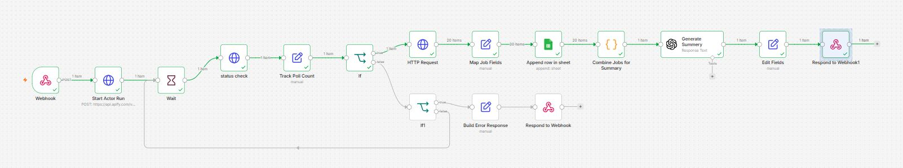
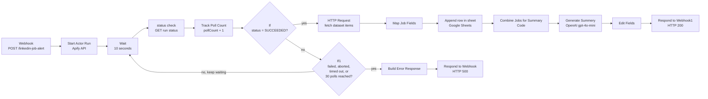
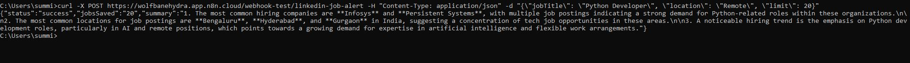
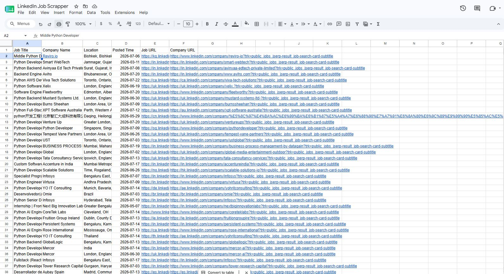

# LinkedIn Job Alert Automation with n8n

An n8n workflow that takes a job title and a location over a webhook, has Apify scrape matching LinkedIn postings, writes every job into Google Sheets, and replies with a short AI summary of who is hiring and where.

I built this for the Module 4 assignment of my automation course. The brief described a recruitment agency whose recruiters spend each morning searching LinkedIn for new software engineering jobs, pasting the listings into a spreadsheet, and sending them to candidates. This workflow handles the searching and the spreadsheet part with a single HTTP request.



## Contents

1. [What it does](#what-it-does)
2. [Tech stack](#tech-stack)
3. [Repository layout](#repository-layout)
4. [How the workflow runs](#how-the-workflow-runs)
5. [Node by node](#node-by-node)
6. [Setup](#setup)
7. [Calling the webhook](#calling-the-webhook)
8. [Output](#output)
9. [Error handling](#error-handling)
10. [Known limitations](#known-limitations)
11. [Ideas for next steps](#ideas-for-next-steps)

## What it does

You send a POST request like this:

```json
{
  "jobTitle": "Python Developer",
  "location": "Remote",
  "limit": 20
}
```

About a minute later (the exact time depends on how long Apify takes), you get this back:

```json
{
  "status": "success",
  "jobsSaved": "20",
  "summary": "1. The most common hiring companies are Infosys and Persistent Systems ... 2. The most common locations are Bengaluru, Hyderabad, and Gurgaon ... 3. A noticeable hiring trend is the emphasis on Python development roles, particularly in AI and remote positions ..."
}
```

By the time that response arrives, 20 new rows are sitting in the Google Sheet, one per job, with the title, company, location, posting date, job link, and company page link.

## Tech stack

| Tool | Role in this project |
| --- | --- |
| [n8n](https://n8n.io) (n8n Cloud) | Runs the workflow and exposes the webhook |
| [Apify](https://apify.com) | Runs the `curious_coder/linkedin-jobs-scraper` actor that does the actual LinkedIn scraping |
| Google Sheets | Where the job listings end up |
| OpenAI `gpt-4o-mini` | Writes the 2 to 3 sentence hiring summary |

## Repository layout

```
.
├── README.md
├── workflow/
│   └── linkedin-job-alert.json      # n8n export, secrets removed (import this)
├── sample-output/
│   ├── linkedin-jobs-sample.xlsx    # the Google Sheet after my test runs
│   └── linkedin-jobs-sample.csv     # same data as CSV so GitHub can preview it
└── screenshots/
    ├── workflow-canvas.jpg          # the full workflow in the n8n editor
    ├── google-sheet-output.jpg      # rows written by the workflow
    └── webhook-response.jpg         # curl call and JSON response
```

## How the workflow runs

The workflow has 16 nodes. Most of the complexity sits in the middle, because Apify scraping runs are asynchronous. When you ask Apify to start a run, it answers right away with a run ID and keeps scraping in the background. So the workflow has to keep checking back until the run finishes, and it needs a way out if the run fails or hangs.



In words:

1. The webhook receives the search criteria.
2. The workflow builds a LinkedIn search URL from them and asks Apify to start a scraping run.
3. It waits 10 seconds, checks the run status, and adds 1 to a poll counter.
4. If the run has succeeded, it downloads the results. If the run has failed, been aborted, or timed out, or if the counter hits 30, it sends back an error. Otherwise it loops back to the wait.
5. Each job gets trimmed to six fields and appended to the Google Sheet.
6. All the jobs get bundled into one JSON string and sent to OpenAI with a request for a short summary.
7. The workflow replies to the original caller with the status, the number of jobs saved, and the summary.

## Node by node

### 1. Webhook

Type: `n8n-nodes-base.webhook`

- Method: `POST`
- Path: `linkedin-job-alert`
- Respond: "Using 'Respond to Webhook' node"

That last setting matters. It keeps the HTTP connection open until one of the two Respond to Webhook nodes at the end fires, so the caller gets the real result (or the real error) instead of an instant "workflow started" message.

The request body has three fields:

| Field | Type | Example | What it's for |
| --- | --- | --- | --- |
| `jobTitle` | string | `Python Developer` | Keywords for the LinkedIn search |
| `location` | string | `Bangladesh`, `Remote` | Location filter |
| `limit` | number | `20` | Maximum number of jobs Apify should scrape |

### 2. Start Actor Run

Type: HTTP Request, `POST https://api.apify.com/v2/actors/curious_coder~linkedin-jobs-scraper/runs`

This starts the Apify actor. The actor takes LinkedIn search URLs as input, so the node builds one from the webhook data:

```json
{
  "urls": ["https://www.linkedin.com/jobs/search/?keywords={{ encodeURIComponent($json.body.jobTitle) }}&location={{ encodeURIComponent($json.body.location) }}"],
  "count": {{ $json.body.limit }},
  "scrapeCompany": true
}
```

`encodeURIComponent` turns `Python Developer` into `Python%20Developer` so spaces and special characters don't break the URL. `scrapeCompany: true` tells the actor to also collect company details, which is where the company LinkedIn URL comes from.

Apify answers immediately with a run object. The two values the rest of the workflow cares about are `data.id` (the run ID, used for status checks) and `data.defaultDatasetId` (where the results will be stored).

The API token goes in a `token` query parameter. See [Setup](#setup) for how to handle it safely.

### 3. Wait

Pauses for 10 seconds. Scraping 20 jobs takes a while, and checking every second would just waste executions and API calls.

This node is also where the polling loop comes back to. When a status check says the run is still going, the item is routed back here.

### 4. status check

Type: HTTP Request, `GET https://api.apify.com/v2/actor-runs/{{ $('Start Actor Run').item.json.data.id }}`

Asks Apify how the run is doing. The answer includes `data.status`, which will be one of `READY`, `RUNNING`, `SUCCEEDED`, `FAILED`, `ABORTED`, or `TIMED-OUT`.

The run ID comes from the Start Actor Run node by name, using `$('Start Actor Run')`. That way it stays correct on every pass through the loop, no matter what the current item looks like.

### 5. Track Poll Count

Type: Edit Fields (Set), with "Include Other Fields" turned on

Adds one field:

```
pollCount = {{ $('Wait').item.json.pollCount ? $('Wait').item.json.pollCount + 1 : 1 }}
```

On the first pass there is no `pollCount` yet, so it starts at 1. On later passes the item coming back through Wait already carries the previous count, so this adds 1 to it. Because other fields are kept, the Apify status response travels along with the counter.

### 6. If (did it succeed?)

Checks `{{ $json.data.status }}` equals `SUCCEEDED` (strict, case sensitive).

- True: go fetch the results.
- False: hand over to If1 to decide between "keep waiting" and "give up".

### 7. If1 (should we give up?)

Four conditions joined with OR:

| Condition | Why |
| --- | --- |
| `data.status` = `FAILED` | The actor crashed |
| `data.status` = `ABORTED` | Someone or something stopped the run |
| `data.status` = `TIMED-OUT` | Apify's own time limit was hit |
| `pollCount` >= 30 | We've waited about 5 minutes (30 × 10 s) and it's still not done |

- True: build an error response.
- False: the run is still `READY` or `RUNNING`, so go back to Wait and try again.

The poll limit is the safety net. Without it, a run stuck in `RUNNING` would keep the workflow looping forever.

### 8. Build Error Response and Respond to Webhook

The Set node creates:

```json
{
  "errorMessage": "error",
  "message": "Apify actor run failed with status: FAILED"
}
```

and Respond to Webhook returns it with HTTP status `500`, so whatever called the webhook can tell something went wrong.

### 9. HTTP Request (fetch results)

Type: HTTP Request, `GET https://api.apify.com/v2/datasets/{{ $('Start Actor Run').item.json.data.defaultDatasetId }}/items`

Downloads every scraped job from the run's dataset. Apify returns a JSON array and n8n splits it into one item per job, which is why the canvas shows "20 items" on the connections from here on.

### 10. Map Job Fields

Type: Edit Fields (Set)

Each scraped job has a lot of fields. This node keeps six and renames them:

| Output field | Apify field |
| --- | --- |
| `jobTitle` | `title` |
| `companyName` | `companyName` |
| `location` | `location` |
| `postedTime` | `postedAt` |
| `jobURL` | `link` |
| `companyUrl` | `companyLinkedinUrl` |

Keeping this separate from the Sheets node means that if the actor ever renames a field, there's exactly one place to fix it.

### 11. Append row in sheet

Type: Google Sheets, operation "Append Row", mapping mode "Map Each Column Manually"

Writes each job as a new row in the `LinkedIn Job Scrapper` spreadsheet, Sheet1:

| Sheet column | Value |
| --- | --- |
| Job Title | `{{ $json.jobTitle }}` |
| Company Name | `{{ $json.companyName }}` |
| Location | `{{ $json.location }}` |
| Posted Time | `{{ $json.postedTime }}` |
| Job URL | `{{ $json.jobURL }}` |
| Company URL | `{{ $json.companyUrl }}` |

Heads-up: in my sheet the header is `Posted Time ` with a trailing space, and the node's column mapping matches it exactly. If you make your own sheet with a clean `Posted Time` header, re-select the column in the node or the date will land nowhere.

### 12. Combine Jobs for Summary

Type: Code (JavaScript)

```javascript
const allJobs = items.map(item => item.json);
return [{
  json: {
    jobsJson: JSON.stringify(allJobs)
  }
}];
```

Up to here, every node ran once per job. For the summary we want the model to see all jobs at once, so this node squashes the 20 items into a single item holding one JSON string. Without it, OpenAI would be called 20 times and you'd get 20 separate "summaries" of one job each.

### 13. Generate Summery

Type: OpenAI (`@n8n/n8n-nodes-langchain.openAi`), model `gpt-4o-mini`

Prompt:

```
Here is a list of job postings in JSON: {{ $json.jobsJson }}

In 2-3 sentences, summarize:
1. The most common hiring companies
2. The most common locations
3. Any noticeable hiring trends
```

`gpt-4o-mini` is cheap and fast, and counting companies and locations doesn't need a bigger model. I used n8n's free OpenAI credits for testing.

### 14. Edit Fields and Respond to Webhook1

Edit Fields builds the success payload:

| Field | Value |
| --- | --- |
| `status` | `success` |
| `jobsSaved` | `{{ $('Map Job Fields').all().length }}` |
| `summary` | `{{ $json.output[0].content[0].text }}` |

`jobsSaved` counts the items that went through Map Job Fields, which is the number of rows written. The summary path matches the output shape of the OpenAI node's Responses API mode.

Respond to Webhook1 returns this with HTTP status `200`.

## Setup

### Prerequisites

- An n8n instance (n8n Cloud or self-hosted)
- An Apify account (the free tier works for testing)
- A Google account for Sheets
- An OpenAI API key, or n8n's free OpenAI credits

### 1. Prepare the Google Sheet

Create a spreadsheet with these headers in row 1 of Sheet1:

```
Job Title | Company Name | Location | Posted Time | Job URL | Company URL
```

### 2. Import the workflow

In n8n, create a new workflow, open the menu (⋯), choose **Import from File**, and pick `workflow/linkedin-job-alert.json`.

### 3. Add your Apify token

Get your token from Apify under **Settings → API & Integrations**.

The exported file has the placeholder `YOUR_APIFY_API_TOKEN` in three nodes: **Start Actor Run**, **status check**, and **HTTP Request**. The quick fix is to paste your token over the placeholder in each.

The better fix is to store it as a credential so it never ends up in an export:

1. In n8n go to **Credentials → Add credential → Query Auth**.
2. Set Name to `token` and Value to your Apify token.
3. In each of the three HTTP Request nodes, set **Authentication** to *Generic Credential Type → Query Auth*, pick the credential, and delete the `token` query parameter.

### 4. Connect Google Sheets and OpenAI

- **Append row in sheet**: select or create a Google Sheets OAuth2 credential, then choose your spreadsheet and Sheet1 (the file contains `YOUR_GOOGLE_SHEET_ID` as a placeholder).
- **Generate Summery**: select your OpenAI credential.

### 5. Activate

Save the workflow and flip the **Active** toggle in the top right. The production URL only responds while the workflow is active.

## Calling the webhook

n8n gives every webhook two URLs:

| URL | When it works |
| --- | --- |
| `https://<your-instance>.app.n8n.cloud/webhook-test/linkedin-job-alert` | Only after you click "Listen for test event" in the editor, and only for one call |
| `https://<your-instance>.app.n8n.cloud/webhook/linkedin-job-alert` | Any time, as long as the workflow is active |

### curl (macOS / Linux)

```bash
curl -X POST https://<your-instance>.app.n8n.cloud/webhook/linkedin-job-alert \
  -H "Content-Type: application/json" \
  -d '{"jobTitle": "Python Developer", "location": "Remote", "limit": 20}'
```

### curl (Windows Command Prompt)

CMD doesn't handle single quotes, so escape the inner double quotes:

```cmd
curl -X POST https://<your-instance>.app.n8n.cloud/webhook/linkedin-job-alert -H "Content-Type: application/json" -d "{\"jobTitle\": \"Python Developer\", \"location\": \"Remote\", \"limit\": 20}"
```

This is the exact call I made while testing:



### Postman

Method `POST`, the production URL, Body → raw → JSON, and paste the sample payload.

## Output

### Google Sheet



The sheet in [`sample-output/`](sample-output/) has 40 rows from my "Python Developer" test runs. A few things show up in the data:

- Infosys appears 5 times, more than any other company. YO IT Consulting, Persistent Systems, and Mercor each appear twice.
- India accounts for 15 of the 40 locations, the United Kingdom 8, and Canada 4.
- Links come from country subdomains (`in.linkedin.com`, `uk.linkedin.com`, `ca.linkedin.com`), because the actor records whichever LinkedIn domain served the posting.

The CSV version is there so you can browse the rows right on GitHub.

### Webhook response

Success (HTTP 200):

```json
{
  "status": "success",
  "jobsSaved": "20",
  "summary": "1. The most common hiring companies are **Infosys** and **Persistent Systems**, with multiple job postings indicating a strong demand for Python-related roles within these organizations.\n\n2. The most common locations for job postings are **Bengaluru**, **Hyderabad**, and **Gurgaon** in India, suggesting a concentration of tech job opportunities in these areas.\n\n3. A noticeable hiring trend is the emphasis on Python development roles, particularly in AI and remote positions, which points towards a growing demand for expertise in artificial intelligence and flexible work arrangements."
}
```

Failure (HTTP 500):

```json
{
  "errorMessage": "error",
  "message": "Apify actor run failed with status: FAILED"
}
```

## Error handling

| Situation | What happens |
| --- | --- |
| Apify run succeeds | Results saved, summary generated, HTTP 200 |
| Run ends as `FAILED`, `ABORTED`, or `TIMED-OUT` | Loop stops, HTTP 500 with the status in the message |
| Run still going after 30 checks (about 5 minutes) | Loop stops, HTTP 500 |
| Run still `READY` or `RUNNING` | Wait 10 seconds and check again |

One quirk: when the 30-poll limit is what stops the loop, the message says "failed with status: RUNNING", since it reports whatever status Apify last returned. It's accurate, just a bit confusing to read.

## Known limitations

- No de-duplication. Running the same search twice appends the same jobs twice, since nothing checks whether a Job URL is already in the sheet.
- `jobsSaved` is a string. The Edit Fields node types it as string, so the response has `"20"` instead of `20`. Switching the field type to Number fixes it.
- The summary contains Markdown. The model wraps names in `**bold**` and uses `\n` line breaks. That's fine for Slack or email but looks odd in a raw JSON reader.
- Some company names aren't in English. Some postings list the company in its local script (one row has a Chinese company name). That's how the posting appears on LinkedIn, not a scraping error.
- `limit` isn't validated. If it's missing, the JSON body sent to Apify is invalid and the Start Actor Run node errors out without replying to the webhook.
- The typo "Summery" in the OpenAI node name is carried over from the build. Renaming it is safe because no expression references it.

## Ideas for next steps

- Swap the Webhook for a Schedule Trigger at 8 a.m. with a fixed list of searches, which is closer to what the agency actually does every morning.
- Before appending, look up each Job URL in the sheet and skip ones already there.
- Send the summary and the new rows to candidates by Gmail or to a Slack channel.
- Add a validation branch for bad input, so a missing `jobTitle` or `limit` returns a clear 400 instead of an n8n error.

## Author

Romith
GitHub: [@ismam-tasnime](https://github.com/ismam-tasnime)
